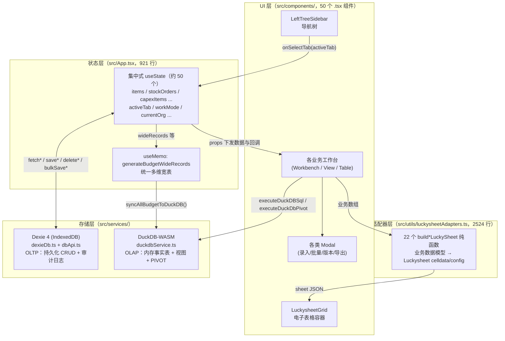

# UEADEMO 系统架构说明

> 现状快照（截至 2026-08-30）。本文档只描述系统当前实际形态，不含重构方案设计。
> 定位：全面预算编制演示与需求说明 SPA，纯前端单机运行，无后端业务逻辑、无 AI 功能。
> 注意：本文档为开发文档，可使用数据库等技术词汇；前端界面文案严禁暴露数据库技术词。

---

## 1. 总体架构

系统为典型的四层纯前端架构：UI 层（React 组件）→ 状态层（App.tsx 集中式 useState）→ 适配器层（Luckysheet 数据适配）→ 存储层（Dexie + DuckDB-WASM 双引擎）。

数据流要点：
- 所有业务数据以 React state（内存数组）为**单一运行时事实源**；Dexie 是持久化副本，DuckDB 是分析副本。
- Luckysheet 通过 index.html 以本地 UMD 脚本全局引入（`window.luckysheet`），不走 npm 模块打包链路（package.json 中的 `luckysheet` 依赖仅作声明，实际运行使用 `public/luckysheet/` 本地化资源）。

---

## 2. 技术栈清单

来源：`package.json`（version 0.0.0，type: module）。

| 类别 | 技术 | 版本 | 用途 |
|---|---|---|---|
| UI 框架 | react / react-dom | ^19.0.1 | 组件渲染 |
| 组件库 | antd | ^6.6.2 | 部分表单/交互组件 |
| 图标 | @ant-design/icons | ^6.3.2 | 图标 |
| 图标 | lucide-react | ^0.546.0 | 主力图标库（侧边栏等） |
| 电子表格 | luckysheet | ^2.1.13 | 编制表引擎（已本地化到 public/luckysheet，UMD 全局加载） |
| 图表 | recharts | ^3.10.1 | 汇总/驾驶舱图表 |
| 动效 | motion | ^12.23.24 | 过渡动画 |
| 样式 | tailwindcss / @tailwindcss/vite | ^4.1.14 | 原子化 CSS（Vite 插件方式） |
| 样式工具 | clsx / tailwind-merge | ^2.1.1 / ^3.6.0 | className 组合 |
| OLTP 存储 | dexie | ^4.4.5 | IndexedDB 封装，持久化 |
| OLAP 引擎 | @duckdb/duckdb-wasm | ^1.33.1-dev57.0 | 浏览器内向量化 SQL 分析 |
| 列式数据 | apache-arrow | ^21.2.0 | DuckDB 结果集载体 |
| Excel | xlsx | ^0.18.5 | 导入/导出 .xlsx |
| 构建 | vite | ^6.2.3 | dev/build |
| 单文件打包 | vite-plugin-singlefile | ^2.3.3 | build:spa 资产内联 |
| 语言 | typescript | ~5.8.2 | 类型系统 |
| dev 服务 | express + tsx | ^4.21.2 / ^4.21.0 | server.ts（Vite 中间件模式，端口 3000） |
| 打包 server | esbuild | ^0.25.0 | build 时打包 server.cjs |
| 其他 | cross-env / dotenv / autoprefixer | — | 环境变量与兼容 |

**存在但当前未被业务代码使用的依赖**：`@google/genai`（项目明确不加 AI）、`sql.js` 及 `@types/sql.js`（存储已迁移至 Dexie，属遗留）。

---

## 3. 双引擎存储模式

两套浏览器内数据引擎按 OLTP / OLAP 分工，互不替代：

### 3.1 Dexie（IndexedDB）— OLTP 持久化

- 文件：`src/services/dexieDb.ts`（Schema 定义 + 种子数据）、`src/services/dbApi.ts`（CRUD API，525 行）。
- 数据库：`BudgetDexieDatabase`，version 1，4 张表：
  - `budget_items`（销售合同预算，主键 id + 多字段索引）
  - `stock_orders`（存量在手订单）
  - `equity_investments`（股权投资，B.7）
  - `audit_logs`（自增 id 审计日志，每次 UPSERT/DELETE/BULK/RESET 自动落一条）
- 首次访问 `seedDexieIfEmpty()` 用 mockData 初始数据集播种。
- `dbApi.ts` 暴露 fetch/save/delete/bulkSave 系列函数，以及：
  - `fetchDbStatus()`：模拟"数据库状态"面板数据（引擎名、表统计、估算体积）。
  - `executeSqlInDb()`：**SQL 仿真器** —— 并非真 SQL 引擎，而是对若干预设查询（GROUP BY region / productCategory / signingEntity、sqlite_master、PRAGMA、audit_logs 等）做模式匹配后用 JS 聚合模拟；另支持以 `db.` 开头的表达式，通过 `new Function` 动态执行 Dexie JS 代码。
  - `resetSqliteDatabase()`：清空四表并重新播种。
- 注意：仅 budget_items / stock_orders / equity_investments 三类数据走 Dexie 持久化；其余 20+ 类业务数据（capex、opex、制造、关联交易等）只存在于 React state，刷新即回到 mock 初始值。

### 3.2 DuckDB-WASM — OLAP 分析

- 文件：`src/services/duckdbService.ts`（405 行）。
- 初始化：`getDuckDB()` 单例惰性加载，bundle 通过 **jsDelivr CDN**（`duckdb.getJsDelivrBundles()`）解析并以 Blob Worker 方式实例化；全程内存库，不落盘。
- 同步机制：`syncAllBudgetToDuckDB(data)`（由 `DuckDbOlapStudioView` 触发，非自动实时同步）：
  1. 将 React state 中各业务数组**逐月反透视（unpivot）**为扁平事实行（每条预算 × 12 个月）；
  2. `registerFileText` 写入 4 个 JSON 虚拟文件；
  3. `CREATE TABLE ... AS SELECT * FROM read_json_auto(...)` 重建 4 张事实表：`fact_budget_contract`、`fact_stock_orders`、`fact_wide_all`、`fact_equity_investments`；
  4. 建立统一星型事实视图 `v_budget_facts_unified`（UNION ALL）及分析视图 `v_sales_by_department`、`v_equity_investment_summary`。
- 查询能力：
  - `executeDuckDBSql()`：任意 SQL，Arrow 结果转 JS 对象（含 BigInt 归一化）。
  - `executeDuckDbPivot()`：为 `MultiDimPivotWorkbench` 生成原生 `PIVOT ... ON ... USING ... GROUP BY` SQL（行维 1/2、列维月/季/区域/产品/模块、sum/count/avg）。
  - `exportQueryToParquet()`：COPY 到虚拟 Parquet 文件后触发浏览器下载。

### 3.3 分工小结

| 维度 | Dexie | DuckDB-WASM |
|---|---|---|
| 角色 | OLTP：行级 CRUD、持久化、审计 | OLAP：多维聚合、PIVOT、即席 SQL |
| 生命周期 | 跨会话持久（IndexedDB） | 页面会话级内存库 |
| 数据来源 | mock 种子 + 用户编辑 | React state 快照（手动同步重建） |
| 一致性 | 与 state 双写（写 state 后异步写 Dexie） | 同步时刻的快照，非实时 |

---

## 4. Luckysheet 适配器模式

`src/utils/luckysheetAdapters.ts`（2524 行）集中所有"业务数据模型 → Luckysheet sheet JSON（celldata/config/合并/边框/公式）"的转换纯函数，UI 组件不直接拼 celldata。共 22 个导出函数：

| 函数名 | 服务页面（activeTab / 组件） | 输入类型 |
|---|---|---|
| buildSalesContractLuckySheet | table（销售合同预算） | BudgetItem[] |
| buildStockOrderLuckySheet | stockOrders（存量在手订单） | StockOrderItem[] |
| buildHardSoftRevenueLuckySheet | hardSoftRevenue（软硬件销售收入） | HardSoftSalesRevenueItem[] |
| buildServiceRevenueLuckySheet | serviceRevenue（服务收入） | ServiceRevenueItem[] |
| buildManufacturingLuckySheet | manufacturing（生产制造预算） | 生产/材料/制费多数组 |
| buildCapexLuckySheet | capex（资产购置预算） | FixedAssetProcurementItem[] |
| buildOpexLuckySheet | opex（费用预算） | OpexBudgetItem[] |
| buildFinancialStatementsLuckySheets | financialStatements（三大财务报表） | （org/year，内部模板） |
| buildIntercompanyMarkupRatesSheet | intercompanyBudget（关联交易-加成率） | IntercompanyMarkupRateItem[] |
| buildIntercompanyProcurementSheet | intercompanyBudget（关联采购） | IntercompanyProcurementBudgetItem[] |
| buildIntercompanySalesSheet | intercompanyBudget（关联销售） | IntercompanySalesBudgetItem[] |
| buildIntercompanyLeasingSheet | intercompanyBudget（关联租赁） | IntercompanyLeasingBudgetItem[] |
| buildIntercompanyAssetTransferSheet | intercompanyBudget（关联资产转移） | IntercompanyAssetTransferBudgetItem[] |
| buildBudgetAssumptionsLuckySheet | budgetAssumptions（预算假设） | BudgetAssumptionItem[] |
| buildBudgetPremisesLuckySheet | budgetPremises（预算前提） | BudgetPremiseItem[] |
| buildExpenseSummaryLuckySheet | expenseBudgetSummary（费用汇总） | OpexBudgetItem[] + EmployeeExpenseBudgetItem[] |
| buildEmployeeExpenseLuckySheet | employeeExpenseImport（人员费用导入） | EmployeeExpenseBudgetItem[] |
| buildProductStandardCostLuckySheet | standardCost/product（产品标准成本） | ProductStandardCostItem[] 等 |
| buildHourlyStandardCostLuckySheet | standardCost/hourly（工时标准成本） | HourlyStandardCostItem[] 等 |
| buildMaterialStandardCostLuckySheet | standardCost/material（材料标准成本） | MaterialStandardCostItem[] 等 |
| buildFinancialInstrumentLuckySheet | financialInstrument（金融工具投资） | FinancialInstrumentInvestmentItem[] |
| buildNonOperatingLuckySheet | nonOperating（营业外收支） | NonOperatingBudgetItem[] |

约定：
- 函数签名普遍为 `(items, org = '甜甜圈集团公司', year = '2027')`，输出可直接喂给 `luckysheet.create()` 的 sheet 对象（含表头合并、样式、月度列、合计公式）。
- 渲染由 `LuckysheetGrid` / `LuckysheetSpreadsheetWorkbench` 等容器组件统一调用全局 `window.luckysheet`。

---

## 5. 导航与路由架构

无路由库（无 react-router），导航即状态：

- **单一归属原则**：`activeTab: NavTabType`（定义于 `LeftTreeSidebar.tsx`，共 28 个字面量值）是页面切换的唯一状态，由 `App.tsx` 持有；App.tsx 第 537–858 行以 `{activeTab === 'xxx' && <XxxView/>}` 的条件渲染串出全部页面，每个 tab 值恰好对应一个视图块。
- **纯目录不绑组件**：侧边栏树中的目录节点（`ROOT_FOLDER_KEYS`：settings/folderBA/folderBB/folderBF/folderBO；`SUB_FOLDER_KEYS`：settingsAA、bbSales、bbTreasury 等 9 个）只负责展开/折叠分组，**不携带 activeTab 值、不渲染任何内容组件**；只有叶子节点触发 `onSelectTab(tab, subTab?)`。
- 二级子页签由独立 state 承载：`masterDataSubTab`、`capexCategorySubTab`、`standardCostSubTab`、`intercompanyInitialTab`，与 activeTab 正交。
- 另有 `workMode: 'demo' | 'spec'` 双模式开关：demo 模式为业务演示，spec 模式切换到需求说明视图（`RequirementSpecView` + `SpecTreeSidebar`），`activeReqId` 定位需求条目。
- 无 URL 同步：刷新后回到默认 tab（`'table'`），导航状态不进浏览器历史。

---

## 6. 构建与交付

三种模式（`package.json` scripts）：

| 模式 | 命令 | 产物 / 行为 |
|---|---|---|
| dev | `npm run dev` → `npx tsx server.ts` | Express(3000 端口) 挂 Vite middlewareMode（appType: spa），HMR 可用 `DISABLE_HMR=true` 关闭 |
| build | `vite build` + `esbuild server.ts → dist/server.cjs` | `dist/` 静态资源 + Node 服务器（`npm start` 生产托管，express.static + SPA fallback） |
| build:spa | `VITE_SINGLEFILE=true vite build` + `node scripts/rename-spa.mjs` | `dist-spa/spa.html` **离线单文件**，实测约 6.5 MB（6,807,290 字节） |

build:spa 细节（`vite.config.ts` + `scripts/rename-spa.mjs`）：
1. `vite-plugin-singlefile` + `assetsInlineLimit=MAX_SAFE_INTEGER` + `inlineDynamicImports` 把应用 JS/CSS 全部内联进 `dist-spa/index.html`；
2. `rename-spa.mjs` 再用正则把 index.html 中 4 个 Luckysheet CSS `<link>` 和 2 个 JS `<script src>` 替换为 `public/luckysheet/` 本地文件的内联内容；
3. 删除中间产物 index.html，最终产出自包含 `spa.html`，可双击离线打开。

路径别名：`@` → 项目根目录。Luckysheet 资源已 100% 本地化于 `public/luckysheet/`（plugins/css、luckysheet.css、iconfont、plugin.js、luckysheet.umd.js）。

**离线例外**：index.html 仍引用 Google Fonts CDN；DuckDB-WASM bundle 运行时从 jsDelivr CDN 拉取 —— 即 spa.html 的"完全离线"不覆盖字体与 OLAP 控制台功能。

---

## 7. 已知技术债务

只列清单与一句话影响，不展开方案：

1. **App.tsx God Component**：921 行、约 50 个 `useState` 全部集中于单组件，所有业务数据经 props 逐层下发 —— 任一状态变更触发整树 re-render，且新增模块必须继续膨胀 App.tsx。
2. **`new Function` 动态执行**（dbApi.ts `executeSqlInDb`）：控制台输入以 `db.` 开头即被 `new Function('db', ...)` 直接求值 —— 任意 JS 注入面，演示场景可容忍但不可带入生产。
3. **空壳 lint 脚本**：`"lint": "npx tsx -e \"console.log('Lint passed')\""` 恒输出通过 —— 代码质量无任何静态检查兜底，CI 中的 lint 通过是假信号。
4. **持久化覆盖不全**：仅 3 类数据走 Dexie，其余 20+ 类业务数据刷新即丢 —— 演示中途刷新会丢失除合同/订单/股权外的所有编辑。
5. **DuckDB 同步为手动快照**：进入 OLAP 控制台才触发 `syncAllBudgetToDuckDB`，分析结果可能落后于最新编辑 —— 存在"分析数据不新鲜"的演示风险。
6. **单文件 SPA 的隐性 CDN 依赖**：Google Fonts 与 DuckDB-WASM jsDelivr bundle 未内联 —— 真离线环境下字体降级、OLAP 控制台不可用。
7. **遗留/未用依赖**：`sql.js`、`@types/sql.js`（已被 Dexie 取代）、`@google/genai`（项目不做 AI）——增加安装体积与依赖审计噪音。
8. **命名残留**：dbApi.ts 中 `resetSqliteDatabase`、`SqliteDbStatus`、`loadDataFromSqlite` 等名称仍叫 SQLite，实际引擎是 Dexie/IndexedDB —— 误导阅读者。
9. **DuckDB PIVOT SQL 字符串拼接**：`executeDuckDbPivot` 的 filter 值直接拼入 WHERE 子句 —— 存在 SQL 注入式破坏（本地内存库，影响限于自身会话）。
10. **luckysheetAdapters.ts 单文件 2524 行 / 22 个函数**：所有表模板集中一处 —— 修改单表模板需在巨型文件中定位，冲突面大。
